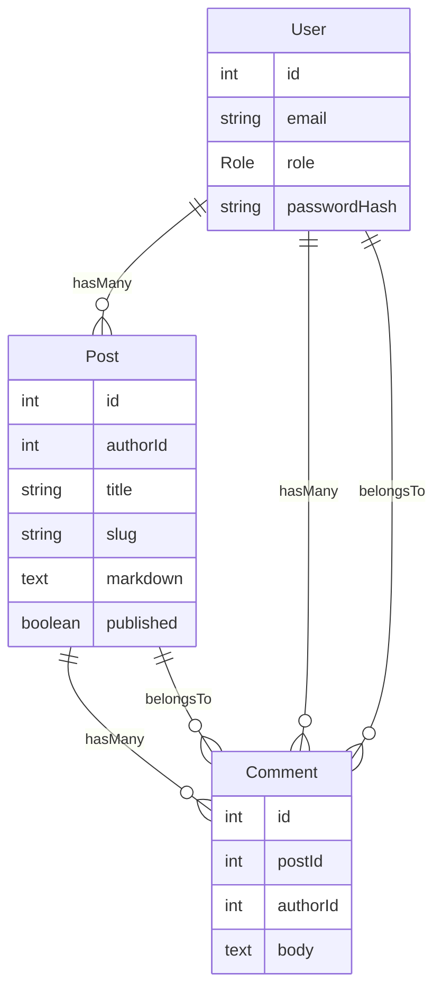

# Markdown Blog API

A robust and scalable RESTful API for a markdown-based blogging platform built with NestJS, TypeScript, and PostgreSQL. This project implements **Clean Architecture** principles to ensure maintainability, testability, and separation of concerns.

## Table of Contents

- [Features](#features)
- [Technology Stack](#technology-stack)
- [Why Clean Architecture?](#why-clean-architecture)
- [Project Structure](#project-structure)
- [Architecture Layers](#architecture-layers)
- [Getting Started](#getting-started)
- [API Endpoints](#api-endpoints)
- [Database Schema](#database-schema)
- [Scripts](#scripts)

## Features

### Authentication & Authorization

- JWT-based authentication
- Role-based access control (Admin/User)
- Secure password hashing with bcrypt

### Posts Management

- Create, read, update, and delete blog posts
- Markdown content support with HTML rendering
- Unique slug generation for SEO-friendly URLs
- Publish/unpublish functionality
- Post ownership validation
- Advanced filtering and pagination
- Search functionality

### Comments System

- Add comments to blog posts
- Update and delete own comments
- Cascade deletion with posts

### Additional Features

- Swagger API documentation
- Comprehensive error handling
- Input validation with class-validator
- Database migrations with Prisma
- Seeding for test data
- E2E testing setup
- Git hooks with Husky and Commitlint

## Technology Stack

- **Framework:** NestJS 11
- **Language:** TypeScript 5.7
- **Database:** PostgreSQL
- **ORM:** Prisma 6
- **Authentication:** JWT, Passport
- **Documentation:** Swagger/OpenAPI
- **Testing:** Jest, Supertest
- **Code Quality:** ESLint, Prettier, Commitlint
- **Package Manager:** pnpm

## Why Clean Architecture?

This project implements **Clean Architecture** (also known as Hexagonal Architecture or Ports and Adapters) to address several critical software engineering challenges:

### 1. **Separation of Concerns**

Clean Architecture enforces clear boundaries between different parts of the application. Each layer has a specific responsibility:

- **Domain** contains business logic and rules
- **Application** orchestrates use cases
- **Infrastructure** handles external concerns (database, APIs)
- **Presentation** manages HTTP requests/responses

This separation makes the codebase easier to understand, navigate, and maintain.

### 2. **Independence from Frameworks**

By isolating business logic from framework-specific code, we ensure:

- Business rules don't depend on NestJS, Prisma, or any other library
- Easy framework upgrades without touching core business logic
- The ability to swap frameworks if needed with minimal impact

### 3. **Testability**

Clean Architecture makes testing significantly easier:

- **Unit tests** can test business logic without databases or HTTP servers
- **Integration tests** can use mock implementations of repositories
- **Use cases** can be tested independently of controllers
- Dependencies flow inward, making mocking straightforward

Example: Testing a use case only requires mocking repository interfaces, not the entire database.

### 4. **Database Independence**

The domain layer knows nothing about Prisma, PostgreSQL, or any specific database:

- Repository interfaces are defined in the domain
- Implementations are in the infrastructure layer
- Easy to switch databases (PostgreSQL → MongoDB) without changing business logic
- Can use in-memory repositories for testing

### 5. **Flexibility and Scalability**

As the application grows, Clean Architecture provides:

- **Easy feature addition** - new use cases don't affect existing ones
- **Multiple interfaces** - can add GraphQL, gRPC, or CLI without touching business logic
- **Team collaboration** - teams can work on different layers independently
- **Microservices readiness** - use cases can be extracted into separate services

### 6. **Business Logic Protection**

The domain layer is at the center and protected from external changes:

- **Value Objects** (Slug, Markdown) encapsulate validation and behavior
- **Entities** (User, Post, Comment) enforce business rules
- **Repository interfaces** define what operations are needed, not how they work
- Changes to UI, database, or external APIs don't affect core business rules

### 7. **Dependency Rule**

Dependencies only flow inward:

```
Presentation → Application → Domain ← Infrastructure
```

- **Domain** depends on nothing (pure business logic)
- **Application** depends only on Domain
- **Infrastructure** depends on Domain (implements interfaces)
- **Presentation** depends on Application (uses use cases)

This prevents tight coupling and makes the codebase resilient to change.

### 8. **Example in This Project**

Consider the `PostEntity`:

```typescript
// Domain - Business rules about posts
export class PostEntity {
  publish() {
    /* business logic */
  }
  unpublish() {
    /* business logic */
  }
}
```

```typescript
// Application - Use case orchestration
export class CreatePostUseCase {
  execute(dto, userId) {
    /* coordinates the workflow */
  }
}
```

```typescript
// Infrastructure - Database implementation
export class PostPrismaRepository implements PostRepository {
  save(post) {
    /* Prisma-specific code */
  }
}
```

```typescript
// Presentation - HTTP handling
@Controller('posts')
export class PostsController {
  create(@Body() dto) {
    /* handles HTTP */
  }
}
```

Each layer has a single responsibility and can be modified or replaced independently.

### Trade-offs

While Clean Architecture provides many benefits, it does come with some considerations:

- **More files and folders** - requires more initial setup
- **Learning curve** - team needs to understand the pattern
- **Boilerplate code** - more interfaces and abstractions

However, these trade-offs pay dividends as the project grows and evolves. The increased maintainability, testability, and flexibility far outweigh the initial complexity for medium to large applications.

## Project Structure

```
src/
├── domain/                    # Enterprise business rules
│   ├── posts/
│   │   ├── entity.posts.ts           # Post entity with business logic
│   │   └── repository.posts.ts       # Repository interface (port)
│   ├── comments/
│   │   ├── entity.comments.ts
│   │   └── repository.comments.ts
│   ├── users/
│   │   ├── entity.users.ts
│   │   └── repository.users.ts
│   └── shared/
│       ├── common/
│       │   └── entity.ts             # Base entity class
│       └── value-object/
│           ├── slug.ts               # Slug value object
│           └── markdown.ts           # Markdown value object
│
├── application/               # Application business rules
│   ├── use-cases/             # Use cases (interactors)
│   │   ├── auth/
│   │   │   ├── login.use-case.ts
│   │   │   └── register.use-case.ts
│   │   ├── posts/
│   │   │   ├── create-post.use-case.ts
│   │   │   ├── update-post.use-case.ts
│   │   │   ├── delete-post.use-case.ts
│   │   │   ├── list-posts.use-case.ts
│   │   │   ├── get-post-by-slug.use-case.ts
│   │   │   ├── toggle-publish.use-case.ts
│   │   │   └── check-slug.use-case.ts
│   │   └── comments/
│   │       ├── create-comment.use-case.ts
│   │       ├── update-comment.use-case.ts
│   │       ├── delete-comment.use-case.ts
│   │       └── list-comments-by-post.use-case.ts
│   ├── dto/                   # Data Transfer Objects
│   │   ├── auth/
│   │   ├── posts/
│   │   └── comments/
│   ├── modules/               # NestJS modules
│   │   ├── auth.module.ts
│   │   ├── posts.module.ts
│   │   └── comments.module.ts
│   └── app.module.ts          # Root module
│
├── infrastructure/            # External interfaces (adapters)
│   ├── database/
│   │   ├── prisma.service.ts         # Prisma client setup
│   │   ├── prisma.module.ts
│   │   └── seed/                     # Database seeding
│   ├── repositories/          # Repository implementations
│   │   ├── user.repository.ts
│   │   ├── post.repository.ts
│   │   └── comment.repository.ts
│   ├── auth/
│   │   ├── jwt.strategy.ts           # Passport JWT strategy
│   │   └── bcrypt.service.ts         # Password hashing
│   ├── markdown/                      # Markdown processing
│   ├── slug/                          # Slug generation
│   └── config/
│       └── config.module.ts
│
├── presentation/              # Controllers, guards, filters
│   ├── controllers/
│   │   ├── auth.controller.ts
│   │   ├── posts.controller.ts
│   │   └── comments.controller.ts
│   ├── guards/
│   │   ├── jwt-auth.guard.ts
│   │   ├── roles.guard.ts
│   │   ├── post-ownership.guard.ts
│   │   └── comment-ownership.guard.ts
│   ├── decorators/
│   │   ├── current-user.decorator.ts
│   │   └── roles.decorator.ts
│   ├── filter/
│   │   └── http-exception.filter.ts
│   └── response/
│       └── response.util.ts          # Standardized responses
│
├── utils/                     # Shared utilities
│   └── regex.ts
│
└── main.ts                    # Application entry point
```

## Architecture Layers

### Domain Layer (Core)

- **Pure business logic** - no dependencies on frameworks or libraries
- **Entities:** Encapsulate business rules and invariants
- **Value Objects:** Immutable objects with validation (Slug, Markdown)
- **Repository Interfaces:** Define contracts for data access (ports)

### Application Layer

- **Use Cases:** Implement application-specific business rules
- **DTOs:** Define input/output data structures
- **Modules:** Wire dependencies using NestJS dependency injection
- Orchestrates the flow between domain and infrastructure

### Infrastructure Layer (Adapters)

- **Repository Implementations:** Concrete implementations using Prisma
- **External Services:** JWT, Bcrypt, Markdown parser
- **Database:** Prisma ORM configuration and migrations
- All framework-specific and third-party code lives here

### Presentation Layer (Interface)

- **Controllers:** Handle HTTP requests/responses
- **Guards:** Authentication and authorization
- **Decorators:** Custom parameter decorators
- **Filters:** Exception handling
- **DTOs:** Request validation using class-validator

## Getting Started

### Prerequisites

- Node.js 18+
- PostgreSQL 12+
- pnpm (or npm/yarn)

### Installation

1. **Clone the repository**

```bash
git clone <repository-url>
cd markdown-blog-api
```

2. **Install dependencies**

```bash
pnpm install
```

3. **Set up environment variables**

Setup a file `.env` by copying the `.env.example` file in the root directory:

```bash
cp .env.example .env
```

4. **Run database migrations**

```bash
npx prisma migrate dev
```

5. **Seed the database (optional)**

```bash
pnpm run seed
```

6. **Start the development server**

```bash
pnpm run start:dev
```

7. **Access the API**

- API: http://localhost:3000/api
- Swagger Documentation: http://localhost:3000/docs

## API Endpoints

### Authentication

| Method | Endpoint         | Description                 | Auth Required |
| ------ | ---------------- | --------------------------- | ------------- |
| POST   | `/auth/register` | Register a new user         | No            |
| POST   | `/auth/login`    | Login and receive JWT token | No            |
| GET    | `/auth/me`       | Get current user            | Yes           |

### Posts

| Method | Endpoint                    | Description                   | Auth Required |
| ------ | --------------------------- | ----------------------------- | ------------- |
| GET    | `/posts`                    | List all posts (with filters) | No            |
| GET    | `/posts/:slug`              | Get post by slug              | No            |
| GET    | `/posts/slug/check/:slug`   | Check if slug is available    | No            |
| POST   | `/posts`                    | Create a new post             | Yes           |
| PATCH  | `/posts/:id`                | Update a post                 | Yes (Owner)   |
| DELETE | `/posts/:id`                | Delete a post                 | Yes (Owner)   |
| PATCH  | `/posts/:id/toggle-publish` | Publish/unpublish post        | Yes (Owner)   |

**Query Parameters for `/posts`:**

- `page` (number): Page number (default: 1)
- `limit` (number): Items per page (default: 10)
- `authorId` (number): Filter by author
- `published` (boolean): Filter by publish status
- `search` (string): Search in title and markdown
- `sort` (createdAt|updatedAt|title): Sort field
- `order` (asc|desc): Sort order

### Comments

| Method | Endpoint               | Description              | Auth Required |
| ------ | ---------------------- | ------------------------ | ------------- |
| GET    | `/comments?postId=:id` | List comments for a post | No            |
| POST   | `/comments`            | Create a comment         | Yes           |
| PATCH  | `/comments/:id`        | Update a comment         | Yes (Owner)   |
| DELETE | `/comments/:id`        | Delete a comment         | Yes (Owner)   |

## Database Schema



### Users

- `id`: Integer (Primary Key)
- `email`: String (Unique)
- `role`: Enum (admin, user)
- `passwordHash`: String
- `createdAt`: DateTime
- `updatedAt`: DateTime
- `deletedAt`: DateTime (Soft delete)

### Posts

- `id`: Integer (Primary Key)
- `authorId`: Integer (Foreign Key → Users)
- `title`: String
- `slug`: String (Unique)
- `markdown`: Text
- `published`: Boolean
- `createdAt`: DateTime
- `updatedAt`: DateTime
- `deletedAt`: DateTime (Soft delete)

### Comments

- `id`: Integer (Primary Key)
- `postId`: Integer (Foreign Key → Posts)
- `authorId`: Integer (Foreign Key → Users)
- `body`: Text
- `createdAt`: DateTime
- `updatedAt`: DateTime

## Scripts

```bash
# Development
pnpm run start:dev          # Start dev server with watch mode
pnpm run start:debug        # Start with debugging

# Build
pnpm run build              # Build for production
pnpm run start:prod         # Run production build

# Database
npx prisma migrate dev      # Run migrations
npx prisma studio           # Open Prisma Studio
pnpm run seed               # Seed database

# Testing
pnpm run test               # Run unit tests
pnpm run test:watch         # Run tests in watch mode
pnpm run test:cov           # Run tests with coverage
pnpm run test:e2e           # Run E2E tests

# Code Quality
pnpm run lint               # Lint and fix
pnpm run format             # Format code with Prettier
pnpm run typecheck          # Type checking
```
